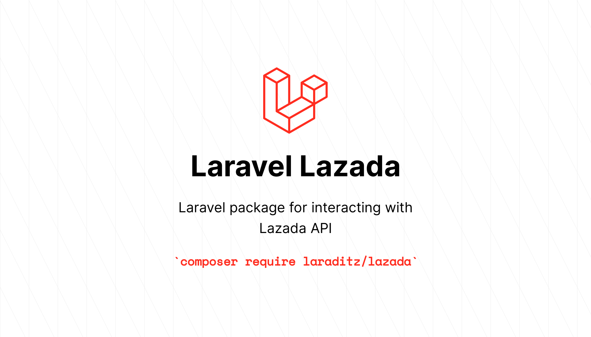

# Laravel Lazada

[](https://packagist.org/packages/laraditz/lazada)
[](https://packagist.org/packages/laraditz/lazada)


Laravel package for interacting with Lazada API.

## Requirements
- PHP 8.1 and above.
- Laravel 9 and above.

## Installation

You can install the package via composer:

```bash
composer require laraditz/lazada
```

## Before Start

Configure your variables in your `.env` (recommended) or you can publish the config file and change it there.
```
LAZADA_APP_KEY=<your_lazada_app_key>
LAZADA_APP_SECRET=<your_lazada_app_secret>
LAZADA_SELLER_ID=MYXXXXXXXX
```

(Optional) You can publish the config file via this command:
```bash
php artisan vendor:publish --provider="Laraditz\Lazada\LazadaServiceProvider" --tag="config"
```

Run the migration command to create the necessary database table.
```bash
php artisan migrate
```

On Lazada Open Platform, configure this **App Callback URL** on your App Management section. Once seller has authorized the app, it will redirect to this URL. Under the hood, it will call API to generate access token so that you do not have to call it manually. If you want to use your own **App Callback URL**, you may specify `LAZADA_APP_CALLBACK_URL` in your `.env`, but you need to manually call the `accessToken()` API to update the access token in your record.
```
// App Callback URL
https://your-app-url.com/lazada/seller/authorized
```

## Available Methods

Below are all methods available under this package. Parameters for all method calls will follow exactly as in [Lazada Open Platform Documentation](https://open.lazada.com/apps/doc/api).

| Service name      | Method name               | Description  
|-------------------|---------------------------|------------------------------
| auth()            | authorizationUrl()        | Get the authorization URL for seller. Seller needs to login and authorized the app.  
|                   | accessToken()             | Generate access token for API call.  
|                   | refreshToken()            | Refresh access token before it expired. 
|                   | accessTokenWithOpenId()   | Generate access token with openId for API call.  
| seller()          | get()                     | Get seller information by current seller ID.
|                   | pickUpStoreList()         | Return the list of pick up store infomation for requested Seller.  
| order()           | list()                    | Get an order list from specified date range.  
|                   | get()                     | Get single order detail by order ID.  
|                   | items()                   | Get the item information of an order.  
| finance()         | payoutStatus()            | Get your transaction statements created after the provided date.  
|                   | accountTransactions()     | Query Account Transactions.  
|                   | logisticsFeeDetail()      | Query logistics fee details from slb.  
|                   | transactionDetail()       | Query seller transaction details within specific date range.  


## Usage

You can use service container to make an api call
```php
app('lazada')->auth()->authorizationUrl(); // give URL to seller to authorize app
app('lazada')->order()->get(order_id: '16090'); // get specific order
```

or you can use facade

```php
use Lazada;
use Laraditz\Lazada\Exceptions\LazadaAPIError;

try {
    // Generate access token. Get the code after seller has authorized the app.
    $accessToken = Lazada::auth()->accessToken(code: '0_123456_XxxXXXXxxXXxxXXXXxxxxxxXXXXxx');   
} catch (LazadaAPIError $e) {
    // Catch API Error
    // $e->getMessage()
    // $e->getMessageCode()
    // $e->getRequestId()
    // $e->getResult() // raw response
    throw $e;
} catch (\Throwable $th) {
    throw $th;
}

// Get order list
Lazada::order()->list(created_after: '2023-11-17T00:00:00+08:00');
```

## Event

This package also provide an event to allow your application to listen for Lazada web push. You can create your listener and register it under event below.

| Event                                     |  Description  
|-------------------------------------------|-----------------------|
| Laraditz\Lazada\Events\WebPushReceived    | Receive a push content from Lazada. 

Read more about Lazada Push Mechanism (LPM) [here](https://open.lazada.com/apps/doc/doc?nodeId=29526&docId=120168).

## Webhook URL

You may setup the Callback URL below on Lazada Open API dashboard, under the Push Mecahnism section so that Lazada will push all content update to this url and trigger the `WebPushReceived` event above.

```
https://your-app-url.com/lazada/webhooks
```
## Commands

```bash
lazada:flush-expired-token    Flush expired access token.
lazada:refresh-token          Refresh existing access token before it expired.
```
As Lazada access token has an expired date, you may want to set `lazada:refresh-token` on scheduler and run it before it expires to refresh the access token. Otherwise, you need the seller to reauthorize and generate a new access token.

#### Token Duration
Live
- Access token: 30 days
- Refresh token: 180 days

Testing
- Access token: 7 days
- Refresh token: 30 days

### Testing

```bash
composer test
```

### Changelog

Please see [CHANGELOG](CHANGELOG.md) for more information what has changed recently.

## Contributing

Please see [CONTRIBUTING](CONTRIBUTING.md) for details.

### Security

If you discover any security related issues, please email raditzfarhan@gmail.com instead of using the issue tracker.

## Credits

-   [Raditz Farhan](https://github.com/laraditz)
-   [All Contributors](../../contributors)

## License

The MIT License (MIT). Please see [License File](LICENSE.md) for more information.
